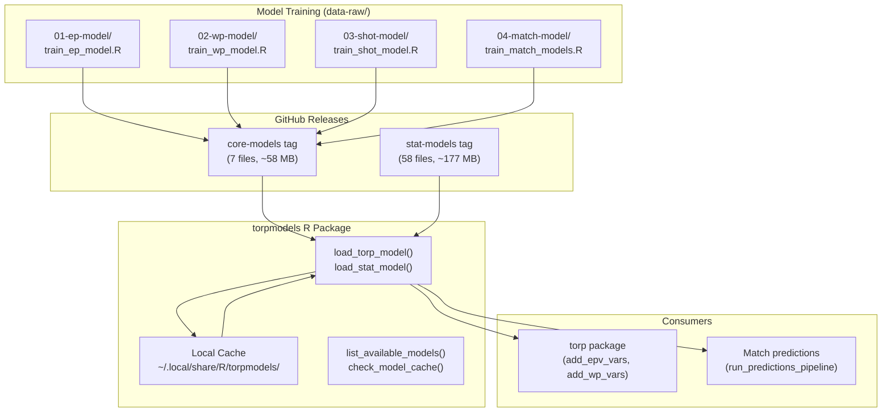
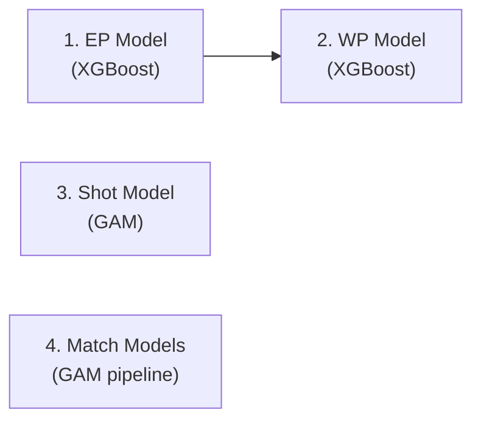

# torpmodels Architecture

## Overview

**torpmodels** is a lightweight R package (~50 KB installed) that serves pre-trained machine learning models for AFL analytics. It functions as a **model registry and caching layer** -- models are stored as RDS files in GitHub Releases and cached locally for fast repeated access.

torpmodels has no data processing logic and no runtime dependency on torp. The relationship is one-directional: torp trains models (in `data-raw/`), torpmodels distributes them.

## Architecture Diagram



## Model Catalog

### Core Models

| Model | Alias | Type | Purpose | Size |
|-------|-------|------|---------|------|
| `ep_model.rds` | `ep` | XGBoost (multiclass, 5 classes) | Expected Points from field position | 794 KB |
| `wp_model.rds` | `wp` | XGBoost (binary logistic) | Win Probability from game state | 319 KB |
| `shot_ocat_mdl.rds` | `shot` | GAM (ordered categorical, 3 levels) | Shot outcome: miss/behind/goal | 19 MB |
| `match_gams.rds` | `match_gams` | GAM pipeline (5 sequential) | Match predictions: xPoints -> score diff -> win prob | 38 MB |
| `shot_player_df.rds` | `shot_player_df` | Lookup table | Player ID to lumped factor mapping for shot model | 7.5 KB |
| `xgb_win_model.rds` | `xgb_win` | XGBoost (legacy) | Deprecated match prediction model | 13 KB |
| `match_xgb_pipeline.rds` | `match_xgb_pipeline` | XGBoost pipeline (5 models) | Evaluation/comparison only | 42 KB |

### Stat Models (58 per-statistic GAMs)

Individual player statistic projection models loaded via `load_stat_model()`:

**Standard Stats (27)**: behinds, bounces, clangers, contested_marks, contested_possessions, disposal_efficiency, disposals, frees_against, frees_for, goal_accuracy, goal_assists, goals, handballs, hitouts, inside50s, intercepts, kicks, marks, marks_inside50, one_percenters, rebound50s, score_involvements, shots_at_goal, tackles, tackles_inside50, time_on_ground_percentage, total_possessions, turnovers, uncontested_possessions

**Extended Stats (31)**: centre_bounce_attendances, contest_def_loss_percentage, contest_def_losses, contest_def_one_on_ones, contest_off_one_on_ones, contest_off_wins, contest_off_wins_percentage, contested_possession_rate, def_half_pressure_acts, effective_disposals, effective_kicks, f50ground_ball_gets, ground_ball_gets, hitout_to_advantage_rate, hitout_win_percentage, hitouts_to_advantage, intercept_marks, kick_efficiency, kick_to_handball_ratio, kickins, kickins_playon, marks_on_lead, pressure_acts, ruck_contests, score_launches, spoils

## Components

### Model Loading & Caching

**Purpose**: Download models from GitHub Releases on first use, cache locally, serve from cache on subsequent loads.

**Key File**: `R/load_model.R`

**Exported Functions**:

| Function | Parameters | Returns |
|----------|-----------|---------|
| `load_torp_model()` | `model_name, force_download, verbose` | Deserialized model object |
| `load_stat_model()` | `stat_name, force_download, verbose` | GAM model object |
| `list_available_models()` | (none) | List with `core_models` + `stat_models` |
| `check_model_cache()` | (none) | Data frame: model, type, cached, size_mb |
| `clear_model_cache()` | `type = "all"` ("all", "core", "stat") | Invisible NULL |

**Cache Location**: `tools::R_user_dir("torpmodels", "cache")/models/` (overridable via `torpmodels.cache_dir` option)

**Cache Structure**:
```
~/.local/share/R/torpmodels/cache/models/
├── core/
│   ├── ep_model.rds
│   ├── wp_model.rds
│   ├── shot_ocat_mdl.rds
│   ├── match_gams.rds
│   └── ...
└── stat-models/
    ├── disposals.rds
    ├── goals.rds
    └── ...
```

**Download Pipeline**:
1. Check local cache
2. If miss: try `piggyback::pb_download()` (preferred)
3. Fallback: direct GitHub URL `https://github.com/peteowen1/torpmodels/releases/download/{tag}/{file}`
4. Validate file size > 1000 bytes (detect error pages)
5. Cache locally for future loads

**Error Handling**: `safe_read_rds()` detects RDS corruption ("unknown input format", "decompression" errors), auto-deletes corrupted files to force re-download, but preserves cache on environment errors (missing packages, OOM).

---

### Model Training

**Purpose**: Train all production models. Lives in `data-raw/` and is not part of the installed package.

**Training Order** (EP must be first -- WP uses EP predictions as features):



| Stage | Directory | Script | Data Source |
|-------|-----------|--------|-------------|
| EP model | `data-raw/01-ep-model/` | `train_ep_model.R` | `torp::load_chains()` + `torp::clean_model_data_epv()` |
| Live EP model | `data-raw/01-ep-model/` | `train_ep_model_live.R` | Same data, 8-feature subset → JSON for Worker |
| WP model | `data-raw/02-wp-model/` | `train_wp_model.R` | PBP with EP predictions |
| Shot model | `data-raw/03-shot-model/` | `train_shot_model.R` | Shot-specific PBP data |
| Match models | `data-raw/04-match-model/` | `train_match_models.R` | `torp::build_team_mdl_df()` |
| Live WP model | `data-raw/05-live-wp-model/` | `train_live_wp_model.R` | PBP data → GAM lookup JSON for browser |

**Release Process** (manual):
```r
piggyback::pb_upload("ep_model.rds", repo = "peteowen1/torpmodels", tag = "core-models")
```

**Important**: The `match_gams.rds` in GitHub Releases is an evaluation reference model. Production match predictions are retrained daily via `torp/data-raw/02-models/build_match_predictions.R`.

---

## Code References

| File | Purpose | Key Symbols |
|------|---------|-------------|
| `R/load_model.R` | All model loading, caching, and management | `load_torp_model()`, `load_stat_model()`, `list_available_models()`, `check_model_cache()`, `clear_model_cache()` |
| `R/torpmodels-package.R` | Package-level documentation | (roxygen2 docs only) |
| `data-raw/01-ep-model/train_ep_model.R` | EP model training | XGBoost multiclass (5 EP outcome classes) |
| `data-raw/02-wp-model/train_wp_model.R` | WP model training | XGBoost binary logistic |
| `data-raw/02-wp-model/train_wp_model_cv_ep.R` | WP with cross-validated EP | True out-of-sample evaluation |
| `data-raw/03-shot-model/train_shot_model.R` | Shot outcome model training | `mgcv::gam()` ordered categorical |
| `data-raw/04-match-model/train_match_models.R` | Match prediction models | 5-model sequential GAM pipeline |
| `data-raw/01-ep-model/train_ep_model_live.R` | Live EP model training | 8-feature XGBoost → JSON tree structure for Worker inference |
| `data-raw/05-live-wp-model/train_live_wp_model.R` | Live WP model training | GAM → JSON lookup table for browser |
| `tests/testthat/test-load_model.R` | Test suite (166 cases) | Name normalization, cache ops, corruption recovery |

## Known Gotchas

| Issue | Impact | Solution |
|-------|--------|----------|
| XGBoost version incompatibility | RDS models may fail to load across XGBoost versions | `load_torp_model("ep", force_download = TRUE)` |
| Shot model requires mgcv loaded | `predict()` fails without `library(mgcv)` (internal `Xbd` function) | Always `library(mgcv)` before shot predictions |
| WP trained on in-sample EP | WP cross-validation metrics ~1-2% optimistic | Use `train_wp_model_cv_ep.R` for true OOS eval |
| match_gams.rds is evaluation-only | Not the production model (production retrained daily) | Production uses `torp::run_predictions_pipeline()` |

## Glossary

| Term | Definition |
|------|------------|
| **Core model** | One of 7 production models (EP, WP, shot, match GAMs, etc.) stored under `core-models` release tag |
| **Stat model** | One of 58 per-statistic GAM models stored under `stat-models` release tag |
| **Model cache** | Local directory where downloaded RDS files are stored for fast repeated access |
| **piggyback** | R package used to manage GitHub Release assets as a lightweight data store |
| **Ordered categorical** | GAM model type for the shot model predicting miss/behind/goal as ordered outcomes |
