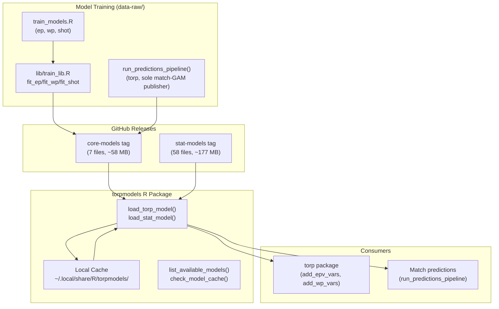
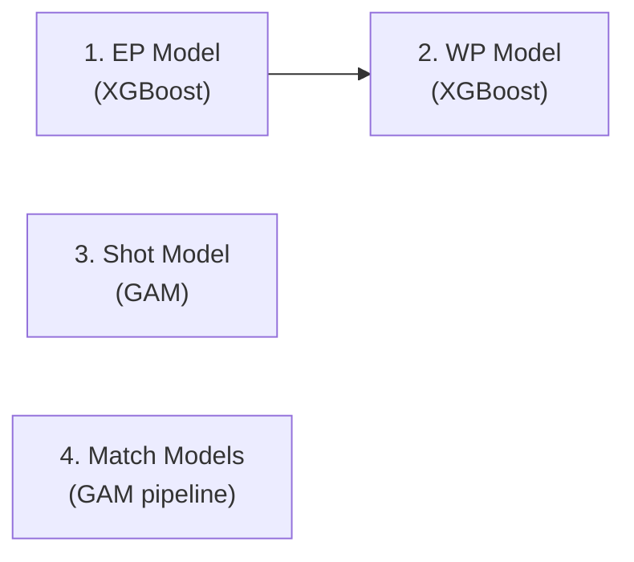

# torpmodels Architecture

## Overview

**torpmodels** is a lightweight R package (~50 KB installed) that serves pre-trained machine learning models for AFL analytics. It functions as a **model registry and caching layer** -- models are stored as RDS files in GitHub Releases and cached locally for fast repeated access.

torpmodels has no data processing logic and no runtime dependency on torp. The relationship is one-directional: torp trains models (in `data-raw/`), torpmodels distributes them.

## Architecture Diagram


```mermaid
graph TB
    subgraph Training["Model Training (data-raw/)"]
        TRAIN_CLI["train_models.R<br/>(ep, wp, shot)"]
        TRAIN_LIB["lib/train_lib.R<br/>fit_ep/fit_wp/fit_shot"]
        MATCH_TRAIN["run_predictions_pipeline()<br/>(torp, sole match-GAM publisher)"]
    end

    subgraph GH["GitHub Releases"]
        CORE["core-models tag<br/>(7 files, ~58 MB)"]
        STAT["stat-models tag<br/>(58 files, ~177 MB)"]
    end

    subgraph Package["torpmodels R Package"]
        LOAD["load_torp_model()<br/>load_stat_model()"]
        CACHE_DIR["Local Cache<br/>~/.local/share/R/torpmodels/"]
        LIST["list_available_models()<br/>check_model_cache()"]
    end

    subgraph Consumers["Consumers"]
        TORP_PKG["torp package<br/>(add_epv_vars, add_wp_vars)"]
        PREDICT["Match predictions<br/>(run_predictions_pipeline)"]
    end

    TRAIN_CLI --> TRAIN_LIB
    TRAIN_LIB --> CORE
    MATCH_TRAIN --> CORE

    CORE --> LOAD
    STAT --> LOAD
    LOAD --> CACHE_DIR
    CACHE_DIR --> LOAD
    LOAD --> TORP_PKG
    LOAD --> PREDICT
```

## Model Catalog

### Core Models

| Model | Alias | Type | Purpose | Size |
|-------|-------|------|---------|------|
| `ep_model.rds` | `ep` | XGBoost (multiclass, 5 classes) | Expected Points from field position | 794 KB |
| `wp_model.rds` | `wp` | XGBoost (binary logistic) | Win Probability from game state | 319 KB |
| `shot_ocat_mdl.rds` | `shot` | GAM (ordered categorical, 3 levels) | Shot outcome: miss/behind/goal | 19 MB |
| `match_gams.rds` | `match_gams` | GAM pipeline (5 sequential) | Match predictions: xPoints -> score diff -> win prob | 38 MB |
| `shot_player_df.rds` | `shot_player_df` | Lookup table | Player ID to lumped factor mapping for shot model | 7.5 KB |
| `xgb_win_model.rds` | `xgb_win` | XGBoost (legacy) | Deprecated match prediction model | 13 KB |
| `match_xgb_pipeline.rds` | `match_xgb_pipeline` | XGBoost pipeline (5 models) | Evaluation/comparison only | 42 KB |

### Stat Models (58 per-statistic GAMs)

Individual player statistic projection models loaded via `load_stat_model()`:

**Standard Stats (27)**: behinds, bounces, clangers, contested_marks, contested_possessions, disposal_efficiency, disposals, frees_against, frees_for, goal_accuracy, goal_assists, goals, handballs, hitouts, inside50s, intercepts, kicks, marks, marks_inside50, one_percenters, rebound50s, score_involvements, shots_at_goal, tackles, tackles_inside50, time_on_ground_percentage, total_possessions, turnovers, uncontested_possessions

**Extended Stats (31)**: centre_bounce_attendances, contest_def_loss_percentage, contest_def_losses, contest_def_one_on_ones, contest_off_one_on_ones, contest_off_wins, contest_off_wins_percentage, contested_possession_rate, def_half_pressure_acts, effective_disposals, effective_kicks, f50ground_ball_gets, ground_ball_gets, hitout_to_advantage_rate, hitout_win_percentage, hitouts_to_advantage, intercept_marks, kick_efficiency, kick_to_handball_ratio, kickins, kickins_playon, marks_on_lead, pressure_acts, ruck_contests, score_launches, spoils

## Components

### Model Loading & Caching

**Purpose**: Download models from GitHub Releases on first use, cache locally, serve from cache on subsequent loads.

**Key File**: `R/load_model.R`

**Exported Functions**:

| Function | Parameters | Returns |
|----------|-----------|---------|
| `load_torp_model()` | `model_name, force_download, verbose` | Deserialized model object |
| `load_stat_model()` | `stat_name, force_download, verbose` | GAM model object |
| `list_available_models()` | (none) | List with `core_models` + `stat_models` |
| `check_model_cache()` | (none) | Data frame: model, type, cached, size_mb |
| `clear_model_cache()` | `type = "all"` ("all", "core", "stat") | Invisible NULL |

**Cache Location**: `tools::R_user_dir("torpmodels", "cache")/models/` (overridable via `torpmodels.cache_dir` option)

**Cache Structure**:
```
~/.local/share/R/torpmodels/cache/models/
├── core/
│   ├── ep_model.rds
│   ├── wp_model.rds
│   ├── shot_ocat_mdl.rds
│   ├── match_gams.rds
│   └── ...
└── stat-models/
    ├── disposals.rds
    ├── goals.rds
    └── ...
```

**Download Pipeline**:
1. Check local cache
2. If miss: try `piggyback::pb_download()` (preferred)
3. Fallback: direct GitHub URL `https://github.com/peteowen1/torpmodels/releases/download/{tag}/{file}`
4. Validate file size > 1000 bytes (detect error pages)
5. Cache locally for future loads

**Error Handling**: `safe_read_rds()` detects RDS corruption ("unknown input format", "decompression" errors), auto-deletes corrupted files to force re-download, but preserves cache on environment errors (missing packages, OOM).

---

### Model Training

**Purpose**: Train all production models. Lives in `data-raw/` and is not part of the installed package.

**Training Order** (EP must be first -- WP uses EP predictions as features; `train_core_models()` in `lib/train_lib.R` enforces this):


```mermaid
graph LR
    EP["1. EP Model<br/>(XGBoost)"] --> WP["2. WP Model<br/>(XGBoost)"]
    SHOT["3. Shot Model<br/>(GAM)"]
    MATCH["4. Match Models<br/>(GAM pipeline)"]
```

| Stage | Directory | Script | Data Source |
|-------|-----------|--------|-------------|
| EP / WP / shot models | `data-raw/` | `train_models.R` (CLI) → `lib/train_lib.R` (`fit_ep`/`fit_wp`/`fit_shot`) | `torp::load_chains()` + `torp:::clean_model_data_epv()`; shot uses `torp::load_pbp()` |
| Live EP model | `data-raw/01-ep-model/` | `train_ep_model_live_v2.R` | Same PBP data, 13-feature subset → JSON for Worker |
| Match models | `data-raw/04-match-model/` | `train_match_models.R` (eval only) + `torp::run_predictions_pipeline()` (sole publisher) | `torp::build_team_mdl_df()` |
| Live WP model | `data-raw/05-live-wp-model/` | `train_live_wp_chain_v4.R` / `train_live_wp_model.R` | PBP data → GAM lookup JSON for browser |

**Release Process**: `train_models.R` calls `publish_model_group()` internally (atomic per model group, updates `models_manifest.json`). Manual/ad-hoc uploads should still go through `publish_model_group()` rather than a bare `piggyback::pb_upload()`, so the manifest ledger stays accurate.

**Important**: The `match_gams.rds` in GitHub Releases is an evaluation reference model. Production match predictions are retrained daily via `torp/data-raw/02-models/build_match_predictions.R`.

---

### Provenance & Manifest

**Purpose**: Make a silent overwrite (like the March→June `wp_model.rds` swap, where a CV-EP model shipped in March was silently replaced in June) detectable by inspection instead of forensics.

**`torp_meta` attribute** (`R/model_meta.R`): every model trained through `train_core_models()` (and every match-GAM upload from `run_predictions_pipeline()`) is stamped via `stamp_model_meta()` before `saveRDS()`. RDS round-trips arbitrary attributes, so this survives cache downloads. Fields: `model`, `schema_version`, `trained_at`, `script`, `seasons`, `n_rows`/`n_matches`, `params` (including the derived WP `monotone_constraints`), `feature_names`, `cv_metric`, `torp_sha`/`torpmodels_sha`, package + R + xgboost versions. `load_torp_model()` prints the stamp (`describe_model_meta()`) when `verbose = TRUE`, and warns -- never hard-fails -- when a loaded model has no stamp (pre-provenance artifact or a non-canonical publish path).

**`models_manifest.json`** (`R/publish.R`): a release-level ledger asset on the `core-models` tag, updated by `update_models_manifest()` after every `publish_model_group()` call. Read-modify-write: a 404 on download means "start fresh"; any other download error aborts rather than risking a clobber. Each artifact entry carries `sha256`, `size`, `uploaded_at`, and a meta subset (model/script/seasons/SHAs/`params_hash`/`cv_metric`); the previous entry moves onto that artifact's `history` (capped at 20). The manifest itself uploads *last*, so artifacts always land before the ledger claims them.

**`publish_model_group()`**: atomic per model group (`.MODEL_GROUPS`: `ep`, `wp`, `shot` = `c(shot_ocat_mdl.rds, shot_player_df.rds)`, `match` = `c(match_gams.rds, match_xgb_pipeline.rds)`). Aborts before any upload if a group member is missing from the output directory -- the fix for the shot model shipping without its `shot_player_df` sidecar.

**`check_manifest_sync()`**: ad hoc drift detector. Compares each release asset's `updated_at`/`size` (via `gh api`) against its manifest record; reports any asset newer/different-size than its manifest entry ("uploaded outside the canonical path") and any manifest entry with no matching asset.

---

## Code References

| File | Purpose | Key Symbols |
|------|---------|-------------|
| `R/load_model.R` | All model loading, caching, and management | `load_torp_model()`, `load_stat_model()`, `list_available_models()`, `check_model_cache()`, `clear_model_cache()` |
| `R/model_meta.R` | Provenance metadata | `build_model_meta()`, `stamp_model_meta()`, `model_meta()`, `describe_model_meta()` |
| `R/publish.R` | Atomic publish + manifest ledger | `publish_model_group()`, `update_models_manifest()`, `check_manifest_sync()` |
| `R/torpmodels-package.R` | Package-level documentation | (roxygen2 docs only) |
| `data-raw/train_models.R` | THE canonical EP/WP/shot training CLI | Arg parsing, `devtools::load_all()` of dev torp + torpmodels, delegates to `lib/train_lib.R` |
| `data-raw/lib/train_lib.R` | Fitting functions shared by `train_models.R` and rebuild Phase 4 | `fit_ep()`, `fit_wp()`, `fit_shot()`, `train_core_models()`, `wp_params()` (derives `monotone_constraints` from `torp:::WP_MODEL_FEATURES`) |
| `data-raw/02-wp-model/validate_cv_ep_wp.R` | Compares in-sample vs CV-EP WP training | Sources `lib/train_lib.R` for shared plumbing |
| `data-raw/04-match-model/train_match_models.R` | Rolling out-of-sample match-model evaluation | 5-model sequential GAM pipeline, evaluation only (no production save) |
| `tests/testthat/test-load_model.R` | Test suite (17 test_that blocks) | Name normalization, cache ops, corruption recovery |
| `tests/testthat/test-model_meta.R` | Provenance stamping/round-trip tests | `build_model_meta()`, `stamp_model_meta()`, `load_torp_model()` warn/describe behavior |
| `tests/testthat/test-publish.R` | Atomic publish/manifest tests | F3 (partial group) regression, manifest 404-vs-transient handling |

## Known Gotchas

| Issue | Impact | Solution |
|-------|--------|----------|
| XGBoost version incompatibility | RDS models may fail to load across XGBoost versions | `load_torp_model("ep", force_download = TRUE)` |
| Shot model requires mgcv loaded | `predict()` fails without `library(mgcv)` (internal `Xbd` function) | Always `library(mgcv)` before shot predictions |
| WP trained on in-sample EP | Metrics ~1-2% optimistic vs true OOS | `train_models.R` defaults to CV-EP (`wp_ep_source = "cv"`); `--insample-ep` is legacy comparison only and never uploads |
| match_gams.rds is evaluation-only | Not the production model (production retrained daily) | Production uses `torp::run_predictions_pipeline()` (sole match-GAM publisher) |

## Glossary

| Term | Definition |
|------|------------|
| **Core model** | One of 7 production models (EP, WP, shot, match GAMs, etc.) stored under `core-models` release tag |
| **Stat model** | One of 58 per-statistic GAM models stored under `stat-models` release tag |
| **Model cache** | Local directory where downloaded RDS files are stored for fast repeated access |
| **piggyback** | R package used to manage GitHub Release assets as a lightweight data store |
| **Ordered categorical** | GAM model type for the shot model predicting miss/behind/goal as ordered outcomes |

## See Also

- `torpverse/ARCHITECTURE.md` -- Ecosystem overview and CI/CD orchestration
- `torp/ARCHITECTURE.md` -- How torp consumes these models
- `torpdata/ARCHITECTURE.md` -- Data distribution and blog aggregation pipeline
